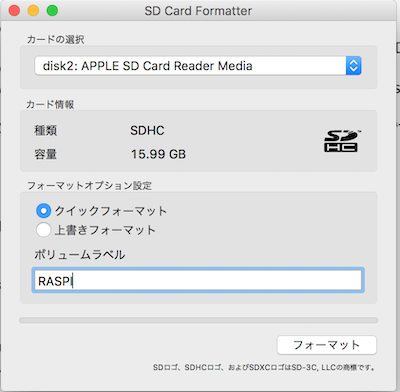

#### 1. OSイメージファイルのDLをします
---
- [ダウンロードページ](https://www.raspberrypi.org/downloads/) からイメージファイルのDLをします。
   - 公式ページはかなり時間がかかりますので、こちらのサイトからDLするのがオススメです。
[http://ftp.jaist.ac.jp/pub/raspberrypi/raspbian/images/](http://ftp.jaist.ac.jp/pub/raspberrypi/raspbian/images/)
- DLしたファイルをunzip して適当なディレクトリにおいてください。

```bash
$ls
2018-03-13-raspbian-stretch.img
```

#### 2. SDカードのデバイス名を確認します
---
- PCのSDカードリーダーにカードが入っていない状態で `df -h` を実行します。

```bash
$df -h
Filesystem      Size   Used  Avail Capacity  iused    ifree %iused  Mounted on
/dev/disk1     233Gi  103Gi  130Gi    45% 27023112 33958134   44%   /
devfs          181Ki  181Ki    0Bi   100%      626        0  100%   /dev
map -hosts       0Bi    0Bi    0Bi   100%        0        0  100%   /net
map auto_home    0Bi    0Bi    0Bi   100%        0        0  100%   /home

```
- 次にSDカードをさした状態で、もう一度 `df -h`を実行します。

```bash
Filesystem      Size   Used  Avail Capacity  iused    ifree %iused  Mounted on
/dev/disk1     233Gi  119Gi  113Gi    52% 31389647 29591599   51%   /
devfs          186Ki  186Ki    0Bi   100%      642        0  100%   /dev
map -hosts       0Bi    0Bi    0Bi   100%        0        0  100%   /net
map auto_home    0Bi    0Bi    0Bi   100%        0        0  100%   /home
/dev/disk2s1  15.4Gi  1.5Gi  5.9Gi    21%        0        0  100%   /Volumes/NO NAME <=※これ
```
- マウントされているリストを比較して、どれがSDカードかを特定します。

- 次のコマンドでも念のため確認します。

```bash
$ diskutil list
/dev/disk0 (internal, physical):
   #:                       TYPE NAME                    SIZE       IDENTIFIER
   0:      GUID_partition_scheme                        *251.0 GB   disk0
   1:                        EFI EFI                     209.7 MB   disk0s1
   2:          Apple_CoreStorage Macintosh HD            250.1 GB   disk0s2
   3:                 Apple_Boot Recovery HD             650.0 MB   disk0s3
/dev/disk1 (internal, virtual):
   #:                       TYPE NAME                    SIZE       IDENTIFIER
   0:                  Apple_HFS Macintosh HD           +249.8 GB   disk1
                                 Logical Volume on disk0s2
                                 C8A2D608-44D7-4FFF-898B-9F3820B3F0CC
                                 Unencrypted
/dev/disk2 (internal, physical):
   #:                       TYPE NAME                    SIZE       IDENTIFIER
   0:     FDisk_partition_scheme                        *16.0 GB    disk2
   1:             Windows_FAT_32 NO NAME                 16.0 GB    disk2s1　　<=※これ
```
Appleで始まるキーワードはOSで使っているデバイスです。 それ以外のデバイスが今回刺したSDカードです。 


この例では`df -k` のコマンドで得られた`/dev/disk2s1`　の `s1`を取り除いた　`/dev/disk2` です。

#### 3. SDカードをフォマーットします
---

OS標準のフォーマットツールではうまくフォーマットできない場合があるため [SD Formatter](https://www.sdcard.org/jp/downloads/formatter_4/index.html)というツールを使います。




#### 4. アンマウントします
---
ddコマンドはマウントされているデバイスには実行できないため、一度アンマウントします。 

```bash
$sudo diskutil umount /dev/disk2
disk2 was already unmounted or it has a partitioning scheme so use "diskutil unmountDisk" instead
```

失敗した場合は、エラーメッセージ通りにやります。

```bash
$sudo diskutil umountDisk /dev/disk2
Unmount of all volumes on disk2 was successful
```

#### 5.ddコマンドでOSイメージを焼きます。
---

```bash
$ sudo dd if=2018-03-13-raspbian-stretch.img of=/dev/rdisk2 bs=1m
```

下記設定すると早く焼けるらしい。
- デバイス名に `r` を付けて/dev/disk2/にする。
- bs=1mオプションを付ける。

この設定で約6,7分で焼くことができます！
実行中は進捗がみれないので、終わるまでじっと待ちましょう。

*SDカードと間違えてハードディスクを指定すると、ハードディスクが上書きされてしまうので、注意が必要です！！*

あとは、このSDカードをRaspberry piに設定して電源を入れれば起動します！


