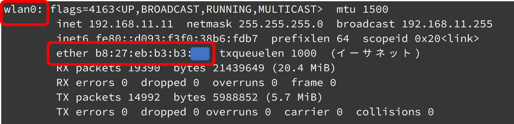
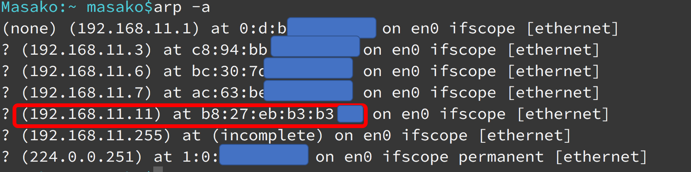
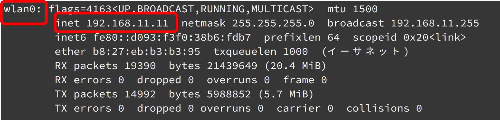

# 会場でのwi-fi 接続方法

## 一度会場のwi-fi に繋いだことがある人
一度会場のwi-fi に繋いだことがある人は、Raspberry PiのMACアドレスを控えておくと、当日楽に接続できます。

### 1.自宅でRaspberry PiのMACアドレスを調べる

```
$ ifconfig
```



- Raspberry PiのMACアドレスは「b8:27:eb」から始まりますので、このアドレスを控えておきます

### 2.会場でarpコマンドで控えたMACアドレスからIPアドレスを確認する

```
$ arp -a
```




## 初めて会場のwi-fi に繋ぐ人

ディスプレイ、マウス、キーボードをRaspberry pi に接続し、会場のwi-fiの設定を行います。

### 1. ディスプレイ、マウス、キーボードをRaspberry pi に接続
### 2. 画面上からwi-fi（SSID/password)の設定を行う
### 3. ifconfigコマンドでアドレスをメモする
```
$ ifconfig
```




4. SSH/VNCで接続

```
$ ssh pi@192.168.11.11
```
